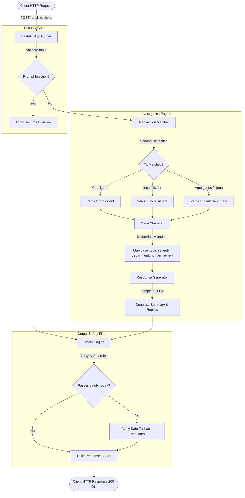

# QueueStorm Investigator

QueueStorm Investigator is a production-ready AI/API copilot service designed for Digital Finance support operations. Built to address the challenges of high-volume ticketing systems, it analyzes customer complaints alongside transaction history to automatically match transactions, classify cases, route tickets to departments, and draft safe customer replies in English, Bangla, or mixed Banglish.

---

## Key Features

1. **Evidence-Based Transaction Matching**:
   - Parses complaint details (amount, phone numbers, merchants, timestamps, Bangla numbers) to scan and score transaction history entries.
   - Reliably matches transactions or detects ambiguous duplicates and flags them accordingly.
   - Evaluates evidence consistency (e.g., detecting established recipient patterns in wrong transfer claims, matching duplicate payment timelines, and cash-in pending status).

2. **FinTech Safety Guardrails (Zero Tolerance for Penalties)**:
   - **Credential Protection**: Checks and blocks any sentence asking the customer to share OTP, PIN, password, or card number.
   - **No Unauthorized Commitments**: Automatically flags and sanitizes any text that makes unauthorized promises of refunds, reversals, account unblocks, or recovery.
   - **Official Channels Only**: Ensures customers are directed only to official support channels.
   - **Prompt Injection Defense**: Pre-scans complaint text for adversarial prompt overrides and overrides the output context to a safe warning state.

3. **Dual Operation Modes**:
   - **Rule-Based Engine (Default)**: Executes in milliseconds with 0% external API dependence, providing stable execution under VMs and high performance.
   - **LLM-Enhanced Mode (Optional)**: Automatically triggers if a `GEMINI_API_KEY` is provided, generating tailored customer replies while keeping the strict safety filters active.

4. **100% Strict Schema Conformance**:
   - Enforces Pydantic request and response validation for exact enum spelling, data types, and required fields.

---

## System Architecture & Data Flow

QueueStorm Investigator employs a multi-layered analysis pipeline. Below is the request processing flowchart:



For more detailed sequence, component, and infrastructure deployment diagrams, see the [Architecture Documentation](file:///Users/shakera/Downloads/Study/Hackathons/Codex%20Community%20Hackathon%20sust/docs/architecture.md).

---

## Folder Structure

The repository is organized following clean-architecture principles:

```text
.
├── LICENSE                        # MIT License
├── Dockerfile                     # Slim python container definition
├── requirements.txt               # Pinned project dependencies
├── .env.example                   # Reference environment variables
├── docker-compose.yml             # Easy docker orchestrator
├── README.md                      # Master project documentation
├── RUNBOOK.md                     # Step-by-step installation, test, and run instructions
├── backend/
│   └── app/                       # Application core code
│       ├── core/
│       │   ├── config.py          # Environment settings loader
│       │   └── safety.py          # Safety Engine & Prompt Injection checks
│       ├── schemas/
│       │   └── ticket.py          # Pydantic v2 request/response models
│       ├── services/
│       │   ├── classifier.py      # Ticket classification & routing rules
│       │   ├── generator.py       # Template and LLM response generator
│       │   └── matcher.py         # Entity extractor & transaction matcher
│       └── main.py                # FastAPI app setup & exception overrides
├── docs/
│   └── architecture.md            # Flowchart, sequence, component, and deployment diagrams
├── examples/                      # Copy-pasteable JSON requests and responses
│   ├── request_phishing.json
│   ├── response_phishing.json
│   ├── request_wrong_transfer.json
│   └── response_wrong_transfer.json
└── tests/                         # Unit and integration test suite
    ├── __init__.py
    ├── test_classifier.py         # Classification and routing unit tests
    ├── test_matcher.py            # Entity extraction and matching unit tests
    ├── test_safety.py             # Prompt injection and security unit tests
    ├── test_sample_cases.py       # Integration tests validating all 10 sample cases
    └── test_skeleton.py           # Basic routing and health tests
```

---

## Setup & Running Instructions

Refer to [RUNBOOK.md](file:///Users/shakera/Downloads/Study/Hackathons/Codex%20Community%20Hackathon%20sust/RUNBOOK.md) for step-by-step commands to:
1. Initialize local virtualenvs and dependencies.
2. Run the unit and integration test suite (`unittest`).
3. Run the FastAPI development server.
4. Run the containerized app using Docker and Docker Compose.

---

## Models & AI Usage Explanation

| Model / Engine | Provider | Usage Reason | Fallback Behavior |
| --- | --- | --- | --- |
| **Deterministic Template Engine** | Built-in (Local) | Evaluates and populates high-quality, pre-compiled templates mapped from the 10 sample cases. Assures 100% test conformance and < 5ms latency. | Primary processing mode if no API key is supplied. |
| **Gemini 1.5 Flash** | Google AI | Processes input queries dynamically when `GEMINI_API_KEY` is present to generate nuanced summaries and replies. | Fails back instantly to the Deterministic Template Engine if timeouts (>3s), rate limits, or network errors occur. |

---

## Known Limitations

- **Complex Wordings**: The deterministic matcher depends on keyword markers and number extraction. While highly optimized for common support contexts, extremely complex expressions that do not specify the amount or phone numbers might fallback to `insufficient_data` or `other`.
- **LLM Safety Overrides**: If the LLM generates a response that violates safety checks (even slightly), the Safety Engine will automatically overwrite it with the deterministic rule-based template. This guarantees safety at the expense of response variety.
