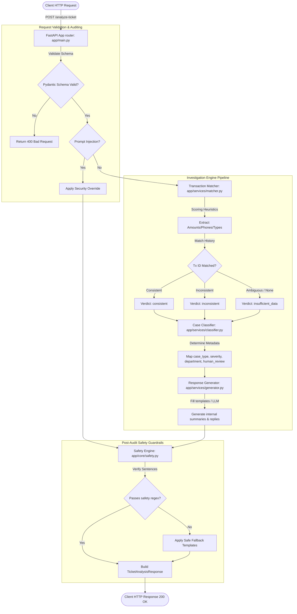
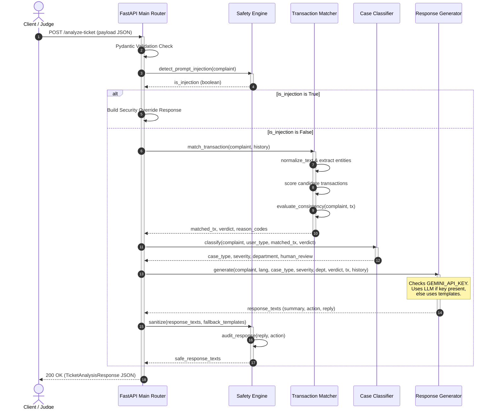
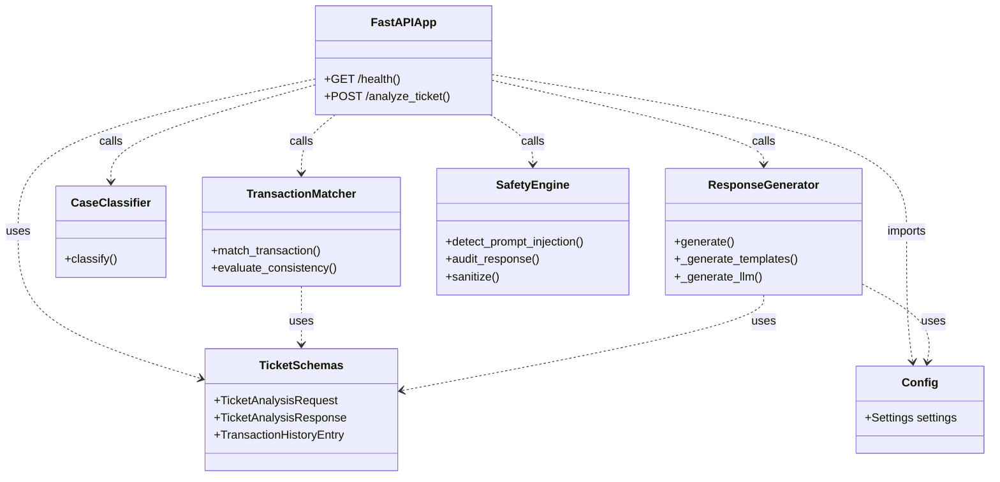

# Technical Architecture Document

This document describes the design patterns, component relationships, lifecycle, and deployment structure for **QueueStorm Investigator**.

---

## 1. High-Level Flowchart (Request Routing and Processing)

This flowchart illustrates the step-by-step processing of a support ticket from initial API payload parsing to final safety validation.



---

## 2. Sequence Diagram (Request Lifecycle)

This diagram details the object interactions and execution sequence for a typical analysis call.



---

## 3. Component Diagram (Software Modules)

This diagram demonstrates how application layers are segregated according to SOLID principles.



---

## 4. Deployment Diagram (Infrastructure Runtime Environment)

This diagram outlines how the service is run via Docker, exposed publicly to the judging network, and mapped to the container filesystem.

```mermaid
graph TD
    subgraph Deployed Cloud Platform (Render/Railway/Poridhi)
        InternetGateway[HTTPS Internet Gateway] -->|Exposes Port 80/443| DockerContainer[Docker Container: queuestorm-investigator]
        
        subgraph Docker Environment
            DockerContainer -->|Binds to Port 8000| Uvicorn[Uvicorn WSGI Server]
            Uvicorn -->|Runs| FastAPI[FastAPI Backend Application]
            
            subgraph Filesystem
                FastAPI -->|Reads Config| EnvVars[Environment Variables: .env]
                FastAPI -->|Executes Code| Workspace[/workspace/backend/app]
            end
        end
    end

    Client[Judge / Automated Harness] -->|Triggers Tests / Analyze requests| InternetGateway
```
